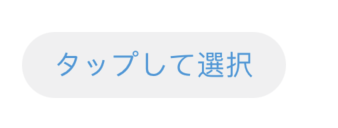

# \[SwiftUI] Custom ButtonStyle



```swift
/**
example
*/
struct GrayButton: ButtonStyle {
    func makeBody(configuration: Configuration) -> some View {
        return configuration.label
            .padding(.horizontal, 16)
            .padding(.vertical, 8)
            .background(AppColor.surface)
            .foregroundColor(AppColor.blue)
            .clipShape(Capsule())
    }
}

/**
usage
*/
Button {
    // action
} label: {
    Text("タップして選択")
}
.buttonStyle(GrayButton())
```
